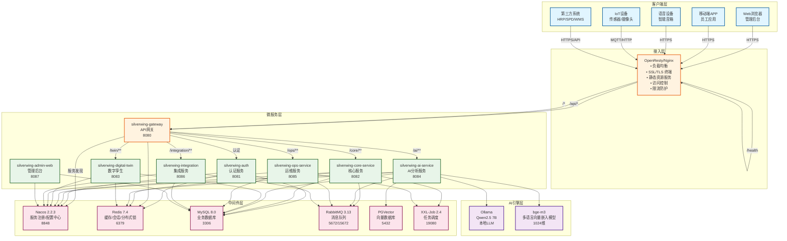
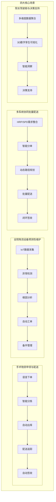
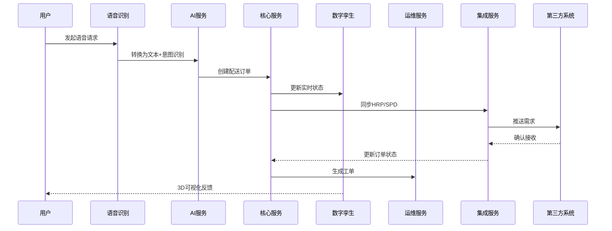

# 银翼智驭医流综合管理平台 - 系统架构文档

## 1. 整体架构图



## 2. 业务架构

### 2.1 核心业务流程



### 2.2 数据流向



## 3. 技术栈

### 3.1 后端技术栈

| 层级 | 技术 | 版本 | 用途 |
|------|------|------|------|
| 开发语言 | Java | 17 | 主语言 |
| 应用框架 | Spring Boot | 3.5.0 | 应用框架 |
| 微服务框架 | Spring Cloud | 2025.0.0 | 微服务基础 |
| 阿里云组件 | Spring Cloud Alibaba | 2025.0.0 | Nacos/Sentinel |
| API网关 | Spring Cloud Gateway | 4.1 | 统一入口 |
| 权限认证 | Sa-Token | 1.40.0 | 无状态认证 |
| 持久层 | MyBatis-Plus | 3.5.9 | ORM框架 |
| 数据库连接池 | Druid | 1.2.23 | 连接池 |
| 缓存 | Redis + Redisson | 7.4 / 3.32.0 | 缓存/分布式锁 |
| 注册/配置 | Nacos | 2.2.3 | 服务发现/配置中心 |
| 消息队列 | RabbitMQ | 3.13 | 异步消息 |
| 任务调度 | XXL-Job | 2.4.2 | 定时任务 |
| AI框架 | LangChain4j | 1.12.2 | LLM编排 |
| 大模型 | Qwen2.5 | 7B | 本地LLM |
| 向量模型 | bge-m3 | Ollama | 多语言向量嵌入（1024维） |
| 向量数据库 | PGVector | 0.5+ | 向量存储 |
| API文档 | Knife4j | 4.5.0 | OpenAPI 3.0 |
| 工具库 | Hutool | 5.8+ | 工具类 |

### 3.2 前端技术栈

| 层级 | 技术 | 版本 | 用途 |
|------|------|------|------|
| 框架 | Vue 3 | 3.4+ | 渐进式框架 |
| 构建工具 | Vite | 5.0+ | 快速构建 |
| UI组件 | Element Plus | - | 企业级组件 |
| 状态管理 | Pinia | 2.1+ | 状态管理 |
| 路由 | Vue Router | 4.2+ | 路由管理 |
| HTTP | Axios | 1.6+ | HTTP客户端 |
| 类型系统 | TypeScript | 5.3+ | 类型检查 |
| 3D可视化 | Three.js / ECharts | - | 3D/图表 |
| 数字孪生 | 自研 | - | 可视化引擎 |

### 3.3 基础设施

| 层级 | 技术 | 版本 | 用途 |
|------|------|------|------|
| 容器化 | Docker | 24.0+ | 容器引擎 |
| 容器编排 | Docker Compose | 2.20+ | 单机编排 |
| 反向代理 | OpenResty | 1.25+ | 高性能网关 |
| 负载均衡 | Nginx | 1.25+ | 反向代理 |

## 4. 微服务详细说明

### 4.1 服务概览

| 服务名称 | 端口 | 路由前缀 | 功能描述 |
|---------|------|---------|----------|
| silverwing-gateway | 8080 | /api | API网关，统一入口 |
| silverwing-auth | 8081 | /auth | 认证授权服务 |
| silverwing-core-service | 8082 | /core | 核心业务服务 |
| silverwing-digital-twin | 8083 | /twin | 数字孪生服务 |
| silverwing-ai-service | 8084 | /ai | AI分析服务 |
| silverwing-ops-service | 8085 | /ops | 运维服务 |
| silverwing-integration | 8086 | /integration | 集成服务 |
| silverwing-admin-web | 8087 | /admin | 管理后台 |

### 4.2 服务详细设计

#### silverwing-gateway（API网关）
**职责：**
- 统一API入口，路由转发到各微服务
- 认证授权（基于Sa-Token）
- 跨域处理
- 限流熔断
- 请求日志记录
- 负载均衡

**技术实现：**
- Spring Cloud Gateway + Nacos服务发现
- Sa-Token Reactor集成
- Resilience4j熔断降级

**核心路由：**
```
/api/auth/** → silverwing-auth
/api/core/** → silverwing-core-service
/api/ai/** → silverwing-ai-service
/api/twin/** → silverwing-digital-twin
/api/ops/** → silverwing-ops-service
/api/integration/** → silverwing-integration
/api/admin/** → silverwing-admin-web
```

注意：所有微服务（包括 admin）统一通过 Gateway 路由，不再由 Nginx 直连。

#### silverwing-auth（认证服务）
**职责：**
- 用户登录/登出
- Token签发与验证
- 权限管理
- 用户信息管理

**核心功能：**
- 登录认证（用户名密码、扫码、SSO）
- Token管理（签发、刷新、吊销）
- RBAC权限模型
- 用户画像管理

#### silverwing-core-service（核心服务）
**职责：**
- 订单管理
- 物流追踪
- 仓储管理
- 运力调度

**核心功能：**
- 订单创建、查询、取消
- 物流状态实时更新
- 仓库出入库管理
- 车辆/机器人调度

#### silverwing-ai-service（AI分析服务）
**职责：**
- NLP自然语言处理
- RAG知识库问答
- 预测性维护
- 智能对话

**核心功能：**
- 意图识别（语音下单指令）
- 实体提取（物资类型、数量、地点）
- 知识库向量化与检索
- IoT异常检测与根因分析

**AI能力：**
- LangChain4j + Ollama (Qwen2.5 7B)
- bge-m3 多语言向量嵌入（1024维，Ollama 托管）
- PGVector 向量数据库
- 时序异常检测算法

#### silverwing-digital-twin（数字孪生服务）
**职责：**
- 3D可视化
- 实时监控
- 仿真模拟
- 数据大屏

**核心功能：**
- 医院建筑3D建模
- 车辆/机器人实时跟踪
- 供应链可视化
- 预警大屏展示

#### silverwing-ops-service（运维服务）
**职责：**
- 设备管理
- 工单管理
- 备件管理
- 运维监控

**核心功能：**
- 设备全生命周期管理
- 工单自动生成与流转
- 备件库存预警
- 设备健康度评估

#### silverwing-integration（集成服务）
**职责：**
- 第三方系统对接
- 数据同步
- 接口适配
- 协议转换

**核心功能：**
- HRP/SPD系统对接
- WMS仓储系统集成
- 数据格式转换
- 消息队列桥接

#### silverwing-admin-web（管理后台）
**职责：**
- 系统管理
- 数据统计
- 报表导出
- 用户管理

**核心功能：**
- 用户权限管理
- 业务数据统计
- 报表生成导出
- 系统配置管理

## 5. 中间件说明

### 5.1 Nacos（服务注册/配置中心）
**用途：**
- 服务注册与发现
- 分布式配置管理
- 健康检查

**配置：**
- 端口：8848
- 默认账号：nacos/nacos
- 命名空间：silverwing-dev（开发）、silverwing-prod（生产）

### 5.2 Redis（缓存/会话）
**用途：**
- Sa-Token会话存储
- 热点数据缓存
- 分布式锁
- 计数器

**配置：**
- 端口：6379
- 密码：环境变量配置
- 持久化：RDB + AOF

### 5.3 MySQL（业务数据库）
**用途：**
- 业务数据持久化
- 用户权限数据
- 订单和物流数据

**配置：**
- 端口：3306
- 版本：8.0
- 字符集：utf8mb4

### 5.4 RabbitMQ（消息队列）
**用途：**
- 异步消息处理
- 服务解耦
- 流量削峰
- 死信队列

**配置：**
- AMQP端口：5672
- 管理控制台：15672
- 默认账号：admin / 见配置

**典型应用：**
- 订单状态变更通知
- 物流轨迹更新
- 设备告警推送

### 5.5 PGVector（向量数据库）
**用途：**
- AI向量存储
- 语义搜索
- 相似度检索
- RAG知识库

**配置：**
- 端口：5432
- 扩展：pgvector
- 数据库：silverwing_vector

### 5.6 XXL-Job（任务调度）
**用途：**
- 定时任务管理
- 分布式任务调度
- 任务监控

**配置：**
- 端口：19080
- 调度策略：Cron表达式
- 访问：http://localhost:19080/xxl-job-admin
- 默认账号：admin / 123456

**典型任务：**
- 订单超时取消
- 设备健康检查
- 数据统计分析

## 6. 数据库设计

### 6.1 核心数据表

| 表名 | 说明 | 所在服务 |
|------|------|----------|
| sys_user | 用户表 | auth |
| sys_role | 角色表 | auth |
| sys_permission | 权限表 | auth |
| delivery_order | 配送订单 | core |
| delivery_track | 配送轨迹 | core |
| warehouse_inventory | 仓库库存 | core |
| device_info | 设备信息 | ops |
| device_maintenance | 设备维护记录 | ops |
| work_order | 工单 | ops |
| knowledge_doc | 知识库文档 | ai |
| knowledge_vector | 知识向量 | ai (PGVector) |
| conversation_session | 对话会话 | ai |
| integration_log | 集成日志 | integration |

### 6.2 索引策略

- 订单表：CREATE INDEX idx_order_status ON delivery_order(status);
- 轨迹表：CREATE INDEX idx_track_order ON delivery_track(order_id);
- 设备表：CREATE INDEX idx_device_type ON device_info(device_type);
- 工单表：CREATE INDEX idx_work_order_status ON work_order(status);

## 7. 安全设计

### 7.1 认证授权
- 基于Sa-Token的无状态认证
- JWT Token机制
- Token过期时间：2小时（可配置）
- 刷新Token机制
- RBAC权限模型

### 7.2 网络安全
- HTTPS加密传输
- Nginx反向代理隐藏后端服务
- 防火墙策略限制端口访问
- 敏感数据加密存储（AES-256）

### 7.3 应用安全
- SQL注入防护（MyBatis预编译）
- XSS攻击防护（前端过滤）
- CSRF防护（Token验证）
- 接口限流防刷（Gateway + Redis）

### 7.4 数据安全
- 数据库访问控制
- 敏感字段脱敏
- 操作日志审计
- 数据备份策略（每日全量+实时binlog）

## 8. 监控与运维

### 8.1 监控指标
- 服务健康状态（Actuator Health）
- QPS和响应时间（Actuator Metrics）
- 错误率统计（Sentry/ELK）
- 资源使用率（Docker Stats）

### 8.2 日志管理
- 统一日志格式（JSON）
- 日志分级输出（TRACE/DEBUG/INFO/WARN/ERROR）
- 日志聚合分析（ELK可选）
- 异常告警（钉钉/邮件）

### 8.3 运维工具
- Docker Compose一键部署
- 容器健康检查
- 服务自动重启
- 滚动更新支持
- XXL-Job任务调度

## 9. 性能优化

### 9.1 缓存策略
- Redis缓存热点数据（字典、配置）
- 本地缓存二级缓存（Caffeine）
- 缓存更新策略（Cache-Aside）
- 缓存预热机制

### 9.2 异步处理
- 消息队列解耦（RabbitMQ）
- 异步任务处理（@Async）
- 批量操作优化
- 连接池管理（Druid）

### 9.3 数据库优化
- 索引优化
- 查询优化
- 读写分离准备
- 慢查询监控（>1s）

## 10. 扩展性设计

### 10.1 水平扩展
- 无状态服务设计（除数据库外）
- 负载均衡支持（Nginx + Gateway）
- 自动扩缩容（K8s HPA预留）
- 分库分表准备（ShardingSphere预留）

### 10.2 垂直扩展
- 服务拆分灵活
- 模块化设计
- 接口标准化
- 配置化管理（Nacos）

## 11. 相关文档

- [部署指南](onepanel-deploy-guide.md)
- [项目README](../README.md)
- [AI服务详细说明](../silverwing-ai-service/README.md)
