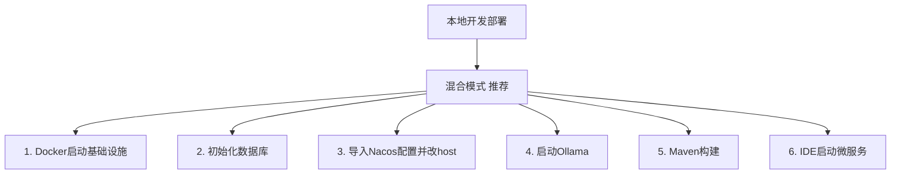

# 本地开发环境部署与测试指南

本文档介绍如何在本地开发环境搭建、测试和运行银翼智驭医流综合管理平台。

> 本文档基于项目实际配置（`onepanel-infra-compose.yml`、各服务 `application.yml`、`scripts/`）编写，覆盖旧版本文档。
>
> **注意**：Nacos 配置模板（`common-*.yml`、`silverwing-*-service.yml` 等）**不随本仓库提交**，需从配置管理中心或历史环境导出后导入 Nacos；对象存储 RustFS 已包含在基础设施 compose 中，AI 服务的 RAG 文件默认持久化到 RustFS（bucket: `silverwing`，前缀 `rag/`）。

## 目录

- [1. 环境要求](#1-环境要求)
- [2. 部署模式说明](#2-部署模式说明)
- [3. 启动基础设施（Docker）](#3-启动基础设施docker)
- [4. 初始化数据库](#4-初始化数据库)
- [5. 配置 Nacos](#5-配置-nacos)
- [6. 启动 Ollama（AI 服务）](#6-启动-ollamaai-服务)
- [7. 构建项目](#7-构建项目)
- [8. 运行测试](#8-运行测试)
- [9. 启动微服务（IDE）](#9-启动微服务ide)
- [10. 启动微服务（命令行）](#10-启动微服务命令行)
- [11. 验证部署](#11-验证部署)
- [12. 常见问题](#12-常见问题)
- [13. 停止服务](#13-停止服务)

---

## 1. 环境要求

| 组件 | 版本要求 | 说明                                   |
|------|---------|--------------------------------------|
| JDK | 17 | 推荐 Eclipse Temurin / OpenJDK         |
| Maven | 3.8+ | 项目构建工具                               |
| Docker Desktop | 最新版 | 用于启动基础设施（含 Compose）                  |
| MySQL | 8.0+ | 业务数据库（由 Docker 提供 8.0.40） |
| Redis | 6.2+ | 缓存和会话存储（由 Docker 提供 6.2.6 redis-stack-server） |
| Nacos | 2.4.3 | 服务注册和配置中心（由 Docker 提供）               |
| RabbitMQ | 3.13+ | 消息队列（由 Docker 提供 3.13.7，core-service 依赖） |
| PostgreSQL | 16（含 pgvector） | 向量数据库（AI 服务依赖，镜像 pgvector/pgvector:pg16） |
| RustFS | 1.0.0-beta.9 | S3 对象存储（AI 服务的 RAG 文件持久化，由 Docker 提供） |
| Ollama | 最新版 | 本地大模型运行（AI 服务依赖）                     |
| IDE | IntelliJ IDEA | 推荐，便于调试微服务                           |
| 内存 | >= 16GB | 运行全部基础设施 + 微服务 + Ollama              |

### 检查环境

```bash
# 检查 Java 版本
java -version

# 检查 Maven 版本
mvn -version

# 检查 Docker
docker --version
docker compose version

# 检查 Ollama（AI 服务需要）
ollama --version
```

> **安装 JDK 17 / Maven**：Windows 推荐通过 [Eclipse Temurin](https://adoptium.net/temurin/releases/?version=17) 安装 JDK；Maven 从 [官网](https://maven.apache.org/download.cgi) 下载并配置 `MAVEN_HOME`、`PATH` 环境变量。macOS 可用 `brew install openjdk@17 maven`。

---

## 2. 部署模式说明

本项目支持三种本地部署模式，**推荐使用混合模式**：

| 模式 | 基础设施 | 微服务 | 适用场景 |
|------|---------|--------|---------|
| **混合模式（推荐）** | Docker Compose 启动 | IDE 中运行 | 日常开发调试，可断点 |
| 全 Docker 模式 | Docker Compose | Docker Compose | 快速验证完整链路 |
| 全本地模式 | 手动安装各组件 | IDE 中运行 | 无 Docker 环境（不推荐） |



下文以**混合模式**为主线展开，全 Docker 模式见 [Docker 部署文档](DOCKER_DEPLOYMENT.md)。

---

## 3. 启动基础设施（Docker）

### 3.1 安装 Docker Desktop

- [Windows / macOS](https://www.docker.com/products/docker-desktop/)
- [Linux](https://docs.docker.com/engine/install/)

### 3.2 启动基础设施

基础设施由 `onepanel-infra-compose.yml` 定义，环境变量在 `onepanel-infra.env` 中。**启动时必须带上 `--env-file`**，否则 Redis/Nginx 等端口变量为空会报错。

```bash
# 启动全部基础设施（MySQL、Redis、Nacos、RabbitMQ、XXL-Job、Nginx）
docker compose -f onepanel-infra-compose.yml --env-file onepanel-infra.env up -d

# 仅启动微服务运行所需的核心基础设施（不含 Nginx/XXL-Job）
docker compose -f onepanel-infra-compose.yml --env-file onepanel-infra.env up -d mysql redis nacos rabbitmq

# 查看启动状态
docker compose -f onepanel-infra-compose.yml ps

# 查看 Nacos 启动日志
docker compose -f onepanel-infra-compose.yml logs -f nacos
```

> **说明**：`mysql` 容器启动时会自动执行 `scripts/init.sql` 和 `scripts/xxl-job.sql`（通过 `docker-entrypoint-initdb.d` 挂载），自动创建 `silverwing_logistics`、`xxl_job`、`nacos_config` 等库，无需手动建库。

### 3.3 基础设施访问信息

| 服务 | 地址 | 账号 / 密码 |
|------|------|------------|
| MySQL | localhost:3307 | root / 123456（见 `onepanel-infra.env`） |
| Redis | localhost:6379 | 无密码 |
| Nacos 控制台 | http://localhost:8848/nacos | nacos / nacos（默认未开启鉴权） |
| RabbitMQ 管理台 | http://localhost:15672 | admin / 123456 |
| XXL-Job 控制台 | http://localhost:19080/xxl-job-admin | admin / 123456 |
| Nginx | http://localhost | - |

### 3.4 验证基础设施

```bash
# 测试 MySQL
docker exec -it mysql-server mysql -uroot -p123456 -e "SHOW DATABASES;"

# 测试 Redis
docker exec -it redis-server redis-cli ping
# 输出：PONG

# 测试 Nacos
curl http://localhost:8848/nacos/v1/console/health/readiness

# 测试 RabbitMQ
curl -u admin:123456 http://localhost:15672/api/overview
```

---

## 4. 初始化数据库

### 4.1 MySQL 数据库（自动 + 手动补充）

`mysql` 容器**首次启动**时会自动执行以下脚本，无需手动导入：
- `scripts/init.sql` → 创建 `silverwing_logistics` 库及业务表
- `scripts/xxl-job.sql` → 创建 `xxl_job` 库及调度表
- Nacos 自建 `nacos_config` 库

**AI 服务数据库需手动导入**（`ai-service.sql` 未挂载到容器）：

```bash
# 导入 AI 服务数据库
docker exec -i mysql-server mysql -uroot -p123456 < scripts/ai-service.sql

# 验证所有数据库
docker exec -it mysql-server mysql -uroot -p123456 -e "SHOW DATABASES;"
# 应包含：silverwing_logistics, silverwing_ai, xxl_job, nacos_config
```

> **注意**：如果 MySQL 数据卷已存在（非首次启动），自动初始化脚本不会重新执行。需先删除卷：`docker volume rm silverwing-logistics-platform_mysql-data`，或手动执行上述 SQL。

### 4.2 PostgreSQL + PGVector（AI 服务）

AI 服务依赖 PostgreSQL + pgvector 扩展存储向量。infra compose 未包含 PostgreSQL，需单独启动：

```bash
# 启动带 pgvector 扩展的 PostgreSQL
docker run -d --name pgvector-server \
  -e POSTGRES_USER=silverwing \
  -e POSTGRES_PASSWORD=silverwing_password \
  -e POSTGRES_DB=silverwing_vector \
  -p 5432:5432 \
  pgvector/pgvector:pg16

# 初始化 pgvector 扩展和向量表
docker exec -i pgvector-server psql -U silverwing -d silverwing_vector < scripts/init-pgvector.sql

# 验证
docker exec -it pgvector-server psql -U silverwing -d silverwing_vector -c "\dx"
# 应看到 vector 扩展
```

> **说明**：AI 服务配置了 `langchain4j.vector-store.pgvector.create-table: true`，向量表会在首次运行时自动创建，`init-pgvector.sql` 主要用于启用 `vector` 扩展和验证。

---

## 5. 配置 Nacos

### 5.1 登录 Nacos 控制台

访问 http://localhost:8848/nacos ，默认账号 `nacos / nacos`。

### 5.2 命名空间说明

各服务 `application.yml` 默认使用 `prod` 命名空间（`${NACOS_NAMESPACE:prod}`）。**本地开发建议直接使用 `prod` 命名空间**，无需额外创建，避免修改每个服务的启动参数。

如需隔离开发环境，可创建 `dev` 命名空间，并在启动微服务时设置环境变量 `NACOS_NAMESPACE=dev`。

### 5.3 导入公共配置

进入 **配置管理 → 配置列表**，选择 `prod` 命名空间，逐个创建以下配置（Data ID / Group / 格式 见各文件头部注释）：

| Data ID | 来源文件 | 说明 |
|---------|---------|------|
| `common-datasource.yml` | `nacos-config-templates/common-datasource.yml` | MySQL 数据源（业务库） |
| `common-redis.yml` | `nacos-config-templates/common-redis.yml` | Redis 连接 |
| `common-rabbitmq.yml` | `nacos-config-templates/common-rabbitmq.yml` | RabbitMQ 连接 |
| `common-sa-token.yml` | `nacos-config-templates/common-sa-token.yml` | Sa-Token 认证 |
| `common-pgvector.yml` | `nacos-config-templates/common-pgvector.yml` | PGVector 向量库 |

> Group 统一为 `DEFAULT_GROUP`，格式为 `YAML`。

### 5.4 ⚠️ 修改配置中的 host（本地混合开发关键步骤）

**这是本地混合开发最容易踩的坑。** 模板中的 host 使用的是**容器别名**（`mysql`、`redis`、`rabbitmq`），仅在 Docker 网络内可解析。当微服务在 IDE（宿主机）中运行时，无法解析这些主机名，必须改为 `localhost`。

在 Nacos 控制台修改以下三个配置：

**① `common-datasource.yml`** —— 将 `mysql` 改为 `localhost`，并将端口改为 `3307`（与 `onepanel-infra.env` 中 `MYSQL_PORT` 一致）：

```yaml
spring:
  datasource:
    url: jdbc:mysql://localhost:3307/silverwing_logistics?useUnicode=true&characterEncoding=utf8&serverTimezone=Asia/Shanghai
    #                 ^^^^^^^^^ ^^^^ 原为 mysql:3306，改为 localhost:3307
    username: silverwing
    password: 123456
```

> **端口说明**：Docker 容器内 MySQL 仍监听 3306，但通过 `MYSQL_PORT=3307` 映射到宿主机 3307 端口，避免与本地已安装的 MySQL 冲突。微服务在宿主机（IDE）中运行，因此 Nacos 配置里必须用 `localhost:3307`。

**② `common-redis.yml`** —— 将 `redis` 改为 `localhost`：

```yaml
spring:
  data:
    redis:
      host: localhost   # 原为 redis，改为 localhost
      port: 6379
```

**③ `common-rabbitmq.yml`** —— 将 `rabbitmq` 改为 `localhost`：

```yaml
spring:
  rabbitmq:
    host: localhost   # 原为 rabbitmq，改为 localhost
    port: 5672
    username: admin
    password: 123456
```

> `common-pgvector.yml` 已使用环境变量占位符 `${PGVECTOR_HOST:localhost}`，默认即 `localhost`，无需修改。
> `common-sa-token.yml` 不含 host 配置，无需修改。

### 5.5 Nacos 鉴权说明

当前 infra compose 默认**未开启** Nacos 鉴权，控制台用 `nacos/nacos` 即可登录，微服务连接也无需验证密码。

> **注意**：各服务 `application.yml` 中 Nacos 密码默认值存在不一致——`core-service` 和 `ops-service` 默认为 `nacos`，其余服务默认为 `123456`。鉴权未开启时不影响运行；若开启鉴权，请统一通过环境变量 `NACOS_PASSWORD=123456` 覆盖。

---

## 6. 启动 Ollama（AI 服务）

AI 服务通过 LangChain4j 调用本地 Ollama 运行的 `qwen2.5:7b-instruct` 模型。

### 6.1 安装 Ollama

- Windows / macOS：从 [ollama.com](https://ollama.com/download) 下载安装
- Linux：`curl -fsSL https://ollama.com/install.sh | sh`

### 6.2 拉取模型

```bash
# 拉取 qwen2.5:7b-instruct 模型（约 4.7GB）
ollama pull qwen2.5:7b-instruct

# 验证模型已下载
ollama list

# 测试模型运行
ollama run qwen2.5:7b-instruct "你好"
```

### 6.3 验证 Ollama 服务

Ollama 安装后会自动作为服务在 `http://localhost:11434` 监听：

```bash
curl http://localhost:11434/api/tags
# 应返回已安装模型列表
```

> **说明**：AI 服务默认连接 `http://localhost:11434`（`${OLLAMA_BASE_URL:http://localhost:11434}`），模型名 `${OLLAMA_MODEL_NAME:qwen2.5:7b-instruct}`。如不启动 AI 服务，可跳过本节。

---

## 7. 构建项目

### 7.1 配置 Maven 镜像加速（推荐）

编辑 `~/.m2/settings.xml`（Windows 为 `%USERPROFILE%\.m2\settings.xml`）：

```xml
<settings>
    <mirrors>
        <mirror>
            <id>aliyun</id>
            <mirrorOf>central</mirrorOf>
            <name>Aliyun Maven</name>
            <url>https://maven.aliyun.com/repository/public</url>
        </mirror>
    </mirrors>
</settings>
```

### 7.2 编译与打包

```bash
# 清理并编译全部模块
mvn clean compile

# 打包（跳过测试，快速生成 JAR）
mvn clean package -DskipTests

# 安装到本地仓库（各子模块互相依赖时需要）
mvn clean install -DskipTests
```

### 7.3 验证构建结果

```bash
# Windows
dir /s /b silverwing-*/target/*.jar

# Linux/macOS
ls -lh silverwing-*/target/*.jar
```

应生成以下 JAR 文件（finalName 与模块名一致）：

| 模块 | JAR 文件 | 端口 |
|------|---------|------|
| silverwing-gateway | `silverwing-gateway/target/silverwing-gateway.jar` | 8080 |
| silverwing-auth | `silverwing-auth/target/silverwing-auth.jar` | 8081 |
| silverwing-core-service | `silverwing-core-service/target/silverwing-core-service.jar` | 8082 |
| silverwing-digital-twin | `silverwing-digital-twin/target/silverwing-digital-twin.jar` | 8083 |
| silverwing-ai-service | `silverwing-ai-service/target/silverwing-ai-service.jar` | 8084 |
| silverwing-ops-service | `silverwing-ops-service/target/silverwing-ops-service.jar` | 8085 |
| silverwing-integration | `silverwing-integration/target/silverwing-integration.jar` | 8086 |
| silverwing-admin-web | `silverwing-admin-web/target/silverwing-admin-web.jar` | 8087 |

---

## 8. 运行测试

### 8.1 运行全部测试

```bash
# 运行所有模块的单元测试
mvn test

# 运行指定模块的测试
mvn test -pl silverwing-core-service

# 运行指定测试类
mvn test -pl silverwing-core-service -Dtest=SomeServiceTest

# 生成测试报告
mvn surefire-report:report
```

测试报告位于各模块 `target/site/surefire-report.html`。

### 8.2 测试说明

- **单元测试**：不依赖外部服务，可直接运行
- **集成测试**：依赖 MySQL / Redis / RabbitMQ 等基础设施，需先按第 3 节启动基础设施
- 若测试因环境缺失失败，可加 `-DskipTests` 跳过

---

## 9. 启动微服务（IDE）

### 9.1 各服务启动类与依赖

| 启动顺序 | 服务 | 启动类（全限定名） | 端口 | Nacos 公共配置依赖 |
|---------|------|-------------------|------|-------------------|
| 1 | gateway | `com.silverwing.gateway.SilverwingGatewayApplication` | 8080 | redis, sa-token |
| 2 | auth | `com.silverwing.auth.SilverwingAuthApplication` | 8081 | datasource, redis, sa-token |
| 3 | core-service | `com.silverwing.core.SilverwingCoreApplication` | 8082 | datasource, redis, rabbitmq |
| 4 | digital-twin | `com.silverwing.twin.SilverwingDigitalTwinApplication` | 8083 | redis |
| 5 | ai-service | `com.silverwing.ai.SilverwingAiServiceApplication` | 8084 | redis, pgvector（自带 MySQL 数据源） |
| 6 | ops-service | `com.silverwing.ops.SilverwingOpsServiceApplication` | 8085 | datasource, redis |
| 7 | integration | `com.silverwing.integration.SilverwingIntegrationApplication` | 8086 | redis |
| 8 | admin-web | `com.silverwing.admin.SilverwingAdminWebApplication` | 8087 | datasource, redis |

> **注意**：启动类统一为 `SilverwingXxxApplication`，不要写成 `XxxApplication`。

### 9.2 IDE 运行配置

在 IntelliJ IDEA 中为每个服务创建运行配置：

- **Main class**：填入上表对应的启动类全限定名
- **Environment variables**（AI 服务专用，其余服务可留空）：

```
MYSQL_USERNAME=silverwing
MYSQL_PASSWORD=123456
```

> AI 服务自带数据源连接 `silverwing_ai` 库，默认账号 `root/root`，需通过环境变量改为 `silverwing/123456`（与 infra.env 一致）。

- **VM options**（可选，如需指定 Nacos 地址）：

```
-Dspring.cloud.nacos.server-addr=localhost:8848
```

### 9.3 启动顺序与依赖

1. **先启动基础设施**（第 3 节）并确认 Nacos 中公共配置已导入并改好 host（第 5 节）
2. **先启动 gateway**（8080），网关负责统一入口
3. 按上表顺序依次启动各业务服务
4. 如不调试 AI 功能，可跳过 ai-service（但需启动 Ollama 和 PGVector，否则 ai-service 会启动失败）

### 9.4 IDEA 多服务启动技巧

使用 IDEA 的 **Services 面板**（View → Tool Windows → Services）可批量管理 Spring Boot 应用：

1. 为每个服务添加 Spring Boot 运行配置
2. 在 Services 面板中可一键启动 / 停止 / 查看日志

---

## 10. 启动微服务（命令行）

### 10.1 Linux / macOS

创建 `start-services.sh`：

```bash
#!/bin/bash

# 设置公共环境变量
export NACOS_SERVER_ADDR=localhost:8848
export NACOS_NAMESPACE=prod

# AI 服务专用变量
export MYSQL_USERNAME=silverwing
export MYSQL_PASSWORD=123456

mkdir -p logs

# 按顺序后台启动服务
java -jar silverwing-gateway/target/silverwing-gateway.jar > logs/gateway.log 2>&1 &
java -jar silverwing-auth/target/silverwing-auth.jar > logs/auth.log 2>&1 &
java -jar silverwing-core-service/target/silverwing-core-service.jar > logs/core-service.log 2>&1 &
java -jar silverwing-digital-twin/target/silverwing-digital-twin.jar > logs/digital-twin.log 2>&1 &
java -jar silverwing-ai-service/target/silverwing-ai-service.jar > logs/ai-service.log 2>&1 &
java -jar silverwing-ops-service/target/silverwing-ops-service.jar > logs/ops-service.log 2>&1 &
java -jar silverwing-integration/target/silverwing-integration.jar > logs/integration.log 2>&1 &
java -jar silverwing-admin-web/target/silverwing-admin-web.jar > logs/admin-web.log 2>&1 &

echo "所有服务已启动，日志在 logs/ 目录"
```

### 10.2 Windows

创建 `start-services.bat`：

```batch
@echo off

set NACOS_SERVER_ADDR=localhost:8848
set NACOS_NAMESPACE=prod
set MYSQL_USERNAME=silverwing
set MYSQL_PASSWORD=123456

if not exist logs mkdir logs

start "Gateway"        java -jar silverwing-gateway\target\silverwing-gateway.jar
start "Auth"           java -jar silverwing-auth\target\silverwing-auth.jar
start "Core Service"   java -jar silverwing-core-service\target\silverwing-core-service.jar
start "Digital Twin"   java -jar silverwing-digital-twin\target\silverwing-digital-twin.jar
start "AI Service"     java -jar silverwing-ai-service\target\silverwing-ai-service.jar
start "Ops Service"    java -jar silverwing-ops-service\target\silverwing-ops-service.jar
start "Integration"    java -jar silverwing-integration\target\silverwing-integration.jar
start "Admin Web"      java -jar silverwing-admin-web\target\silverwing-admin-web.jar

echo 所有服务已启动
pause
```

> **提示**：命令行启动前需先执行 `mvn clean package -DskipTests` 生成 JAR 文件。

---

## 11. 验证部署

### 11.1 检查服务注册

访问 Nacos 控制台 http://localhost:8848/nacos ，进入 **服务管理 → 服务列表**，确认各微服务已注册且状态为 `UP`：

| 服务名 | 期望实例数 | 状态 |
|--------|-----------|------|
| silverwing-gateway | 1 | UP |
| silverwing-auth | 1 | UP |
| silverwing-core-service | 1 | UP |
| silverwing-digital-twin | 1 | UP |
| silverwing-ai-service | 1 | UP |
| silverwing-ops-service | 1 | UP |
| silverwing-integration | 1 | UP |
| silverwing-admin-web | 1 | UP |

### 11.2 健康检查

```bash
# 批量检查各服务健康状态（通过 actuator）
for port in 8080 8081 8082 8083 8084 8085 8086 8087; do
  echo -n "Port $port: "
  curl -s http://localhost:$port/actuator/health | grep -o '"status":"[^"]*"'
  echo
done
```

期望每个服务输出 `"status":"UP"`。

### 11.3 访问 API 文档

通过网关访问聚合 API 文档：http://localhost:8080/doc.html

### 11.4 依赖检查清单

| 检查项 | 命令 | 期望结果 |
|--------|------|---------|
| MySQL 连通 | `docker exec mysql-server mysql -uroot -p123456 -e "SELECT 1"` | 返回结果 |
| Redis 连通 | `docker exec redis-server redis-cli ping` | PONG |
| Nacos 连通 | `curl http://localhost:8848/nacos/v1/console/health/readiness` | ok |
| RabbitMQ 连通 | `curl -u admin:123456 http://localhost:15672/api/overview` | JSON 响应 |
| PostgreSQL 连通 | `docker exec pgvector-server psql -U silverwing -d silverwing_vector -c "SELECT 1"` | 返回结果 |
| Ollama 连通 | `curl http://localhost:11434/api/tags` | 模型列表 |

---

## 12. 常见问题

### 12.1 端口被占用

**问题**：启动报错 `Port 8080 is already in use`

**解决**：

```bash
# Windows：查找并终止占用进程
netstat -ano | findstr :8080
taskkill /PID <进程ID> /F

# Linux/macOS
lsof -i :8080
kill -9 <进程ID>
```

### 12.2 ⚠️ Nacos 配置中的容器别名无法解析

**问题**：微服务在 IDE 中启动报错 `Unknown host: mysql` 或 `Unknown host: redis` / `rabbitmq`

**原因**：Nacos 公共配置模板中 host 使用了 Docker 容器别名（`mysql`、`redis`、`rabbitmq`），宿主机无法解析。

**解决**：按 [5.4 节](#54-️-修改配置中的-host本地混合开发关键步骤) 在 Nacos 控制台将对应配置中的 host 改为 `localhost`。

### 12.3 数据库连接失败

**问题**：日志显示 `Communications link failure` 或 `Access denied`

**解决**：

```bash
# 1. 检查 MySQL 容器是否健康
docker ps | findstr mysql

# 2. 验证账号密码（infra.env 中为 root/123456, silverwing/123456）
docker exec -it mysql-server mysql -usilverwing -p123456 -e "SELECT 1"

# 3. 检查 Nacos 中 common-datasource.yml 的 host 是否已改为 localhost
```

### 12.4 RabbitMQ 连接失败（core-service）

**问题**：core-service 启动报错无法连接 RabbitMQ

**原因**：core-service 拉取了 `common-rabbitmq.yml`，未启动 RabbitMQ 或 host 未改。

**解决**：确保 RabbitMQ 容器已启动，且 `common-rabbitmq.yml` 中 host 已改为 `localhost`。

### 12.5 AI 服务启动失败

**问题**：ai-service 启动失败或 Ollama 调用超时

**排查**：

```bash
# 1. 检查 Ollama 是否运行
curl http://localhost:11434/api/tags

# 2. 检查模型是否已拉取
ollama list   # 应包含 qwen2.5:7b-instruct

# 3. 检查 PostgreSQL + PGVector
docker ps | findstr pgvector

# 4. 检查 AI 服务数据库账号（默认 root/root，需改环境变量）
#    在 IDE 中设置 MYSQL_USERNAME=silverwing MYSQL_PASSWORD=123456
```

### 12.6 Nacos 连接失败

**问题**：服务无法连接 Nacos

**解决**：

```bash
# 1. 检查 Nacos 容器状态
docker compose -f onepanel-infra-compose.yml ps nacos

# 2. 查看 Nacos 日志
docker compose -f onepanel-infra-compose.yml logs nacos

# 3. 验证健康端点
curl http://localhost:8848/nacos/v1/console/health/readiness
```

### 12.7 Maven 依赖下载失败

**问题**：`Could not resolve dependencies`

**解决**：

```bash
# 1. 清理本地仓库缓存并强制更新
mvn clean install -U

# 2. 配置阿里云镜像（见 7.1 节）
```

### 12.8 core-service / ops-service Nacos 密码不一致

**问题**：开启 Nacos 鉴权后，core-service / ops-service 连接失败

**原因**：这两个服务 `application.yml` 中 Nacos 密码默认为 `nacos`，其余服务为 `123456`。

**解决**：在 IDE 运行配置中为这两个服务添加环境变量 `NACOS_PASSWORD=123456`。

### 12.9 MySQL 初始化脚本未执行

**问题**：数据库表为空，`silverwing_logistics` 库不存在

**原因**：MySQL 数据卷已存在，`docker-entrypoint-initdb.d` 脚本仅在首次创建卷时执行。

**解决**：

```bash
# 删除数据卷后重新启动（会清空所有数据）
docker compose -f onepanel-infra-compose.yml down -v
docker compose -f onepanel-infra-compose.yml --env-file onepanel-infra.env up -d mysql
```

---

## 13. 停止服务

### 13.1 停止微服务

```bash
# Windows：终止所有 Java 进程
taskkill /F /IM java.exe

# Linux/macOS
pkill -f "silverwing-.*\.jar"
```

### 13.2 停止基础设施（Docker）

```bash
# 停止全部基础设施（保留数据）
docker compose -f onepanel-infra-compose.yml down

# 停止并删除数据卷（清空所有数据，慎用）
docker compose -f onepanel-infra-compose.yml down -v

# 单独停止 PGVector（AI 服务）
docker stop pgvector-server
```

### 13.3 停止 Ollama

```bash
# Windows：停止 Ollama 服务（在系统托盘右键退出，或）
taskkill /F /IM ollama.exe

# Linux/macOS
pkill ollama
```

---

## 相关文档

- [Docker 容器化部署](DOCKER_DEPLOYMENT.md) - 全 Docker 模式部署指南
- [完整部署文档](DEPLOYMENT.md) - 生产环境部署
- [系统架构](ARCHITECTURE.md) - 系统架构说明
- [项目 README](../README.md) - 项目概览
