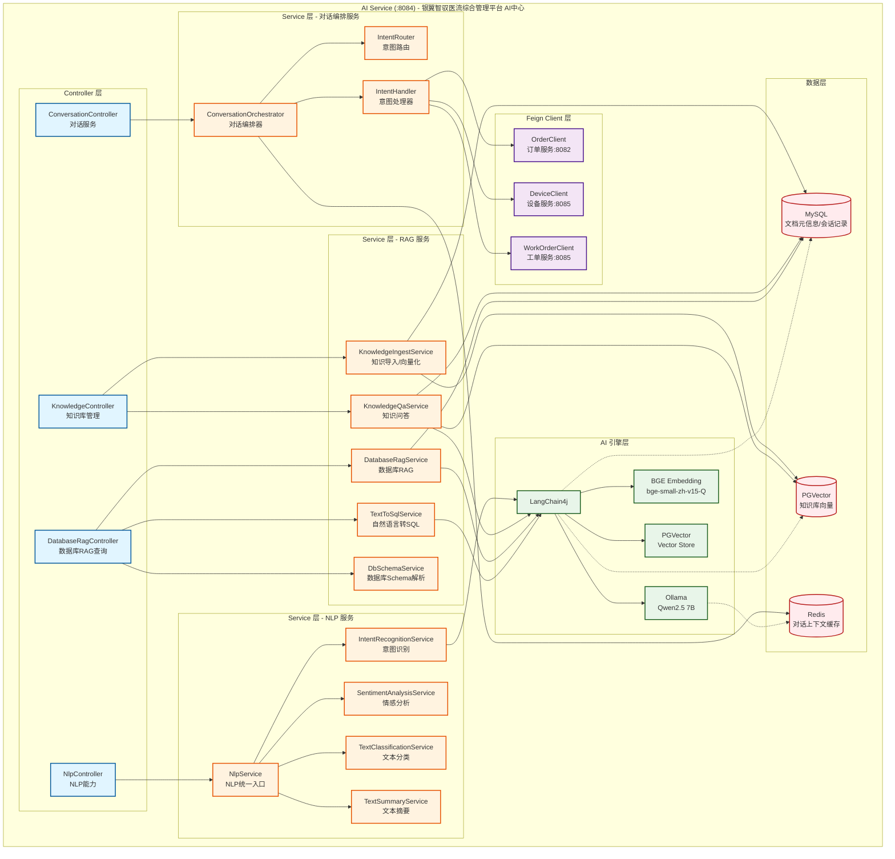

# silverwing-ai-service

AI智能服务 - 医疗智慧物流平台的AI能力中心

## 模块职责

| 模块 | 说明 |
|------|------|
| **NLP服务** | 意图识别、实体提取、文本分类、情感分析、文本摘要 |
| **RAG知识库** | 文档向量化存储、智能问答、知识检索 |
| **对话服务** | 统一对话入口、智能路由、多轮对话 |
| **预测维护** | 异常检测、根因分析、故障预测 |

## 技术架构



## 核心功能

### 1. 知识库向量化 (RAG)

```bash
# 导入文档到知识库
POST /api/ai/knowledge/ingest
{
  "title": "气动物流设备维护手册",
  "content": "气动物流系统日常维护要点...",
  "category": "设备手册",
  "sourceType": "manual",
  "warehouseId": "WH001",
  "deviceType": "气动物流"
}

# 知识问答
POST /api/ai/knowledge/qa
{
  "question": "如何清洁气动物流管道？",
  "warehouseId": "WH001",
  "deviceType": "气动物流"
}
```

### 2. NLP能力

```bash
# 综合NLP分析
POST /api/ai/nlp/analyze
{
  "text": "3楼手术室需要配送一批输液器"
}

# 意图识别
POST /api/ai/nlp/intent
{
  "text": "查询订单ORD123456的状态"
}
```

### 3. 对话服务

```bash
# 智能对话
POST /api/ai/conversation/chat
{
  "message": "手术室的配送订单到哪了？",
  "userId": 1001,
  "sessionId": "session-uuid"
}
```

## 依赖服务

| 服务 | 端口 | 说明 |
|------|------|------|
| silverwing-core | 8082 | 订单服务 |
| silverwing-ops | 8083 | 设备/工单服务 |
| silverwing-gateway | 8080 | API网关 |

## 外部依赖

| 组件 | 说明 | 必需 |
|------|------|------|
| Ollama | 本地LLM模型服务 | 是 |
| PGVector | 向量数据库 | 是 |
| MySQL | 业务数据存储 | 是 |
| Redis | 缓存/会话 | 是 |

## 配置说明

### 必需配置 (application.yml)

```yaml
# LangChain4j - Ollama本地模型
langchain4j:
  ollama:
    base-url: http://localhost:11434
    model-name: qwen2.5:7b-instruct

# 向量数据库
langchain4j:
  vector-store:
    pgvector:
      host: localhost
      port: 5432
      database: silverwing_vector
```

### 可选配置

```yaml
# Spring AI - OpenAI (可选)
spring:
  ai:
    openai:
      api-key: ${OPENAI_API_KEY:}

# Spring AI - 通义千问 (可选)
spring:
  ai:
    qwen:
      api-key: ${QWEN_API_KEY:}
```

## 启动前置

1. **启动Ollama服务**
   ```bash
   ollama serve
   ollama pull qwen2.5:7b-instruct
   ```

2. **启动PGVector**
   ```bash
   docker run -d \
     --name pgvector \
     -e POSTGRES_PASSWORD=password \
     -e POSTGRES_DB=silverwing_vector \
     -p 5432:5432 \
     pgvector/pgvector
   ```

3. **执行数据库脚本**
   ```bash
   mysql -u root -p < scripts/ai-service.sql
   ```

## API文档

启动服务后访问: `http://localhost:8084/doc.html`

## 业务场景

| 场景 | 功能 | API |
|------|------|-----|
| 手术物资语音下单 | 语音识别→NLU解析→订单创建 | `/api/ai/voice/order` |
| 设备故障咨询 | 知识库问答 | `/api/ai/knowledge/qa` |
| 设备异常检测 | 时序分析→异常识别 | `/api/ai/predictive-maintenance/anomaly/detect` |
| 根因分析 | 数字孪生→关联推理 | `/api/ai/predictive-maintenance/root-cause/{deviceId}` |
